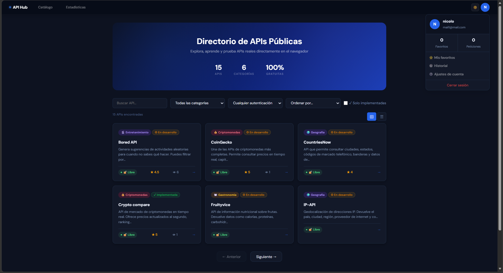
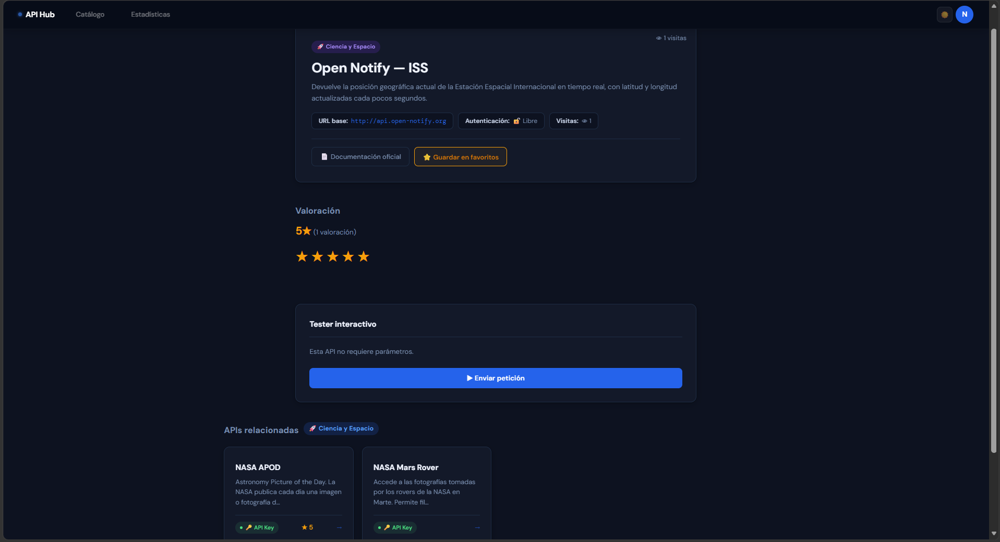
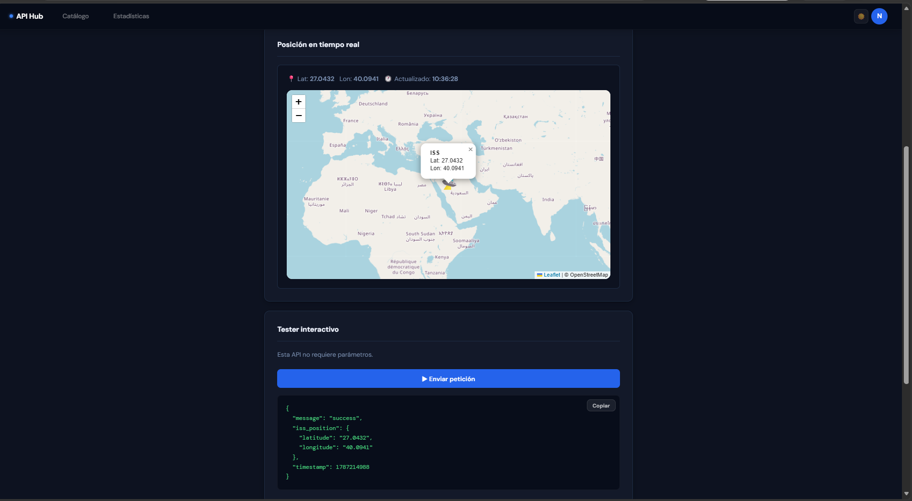
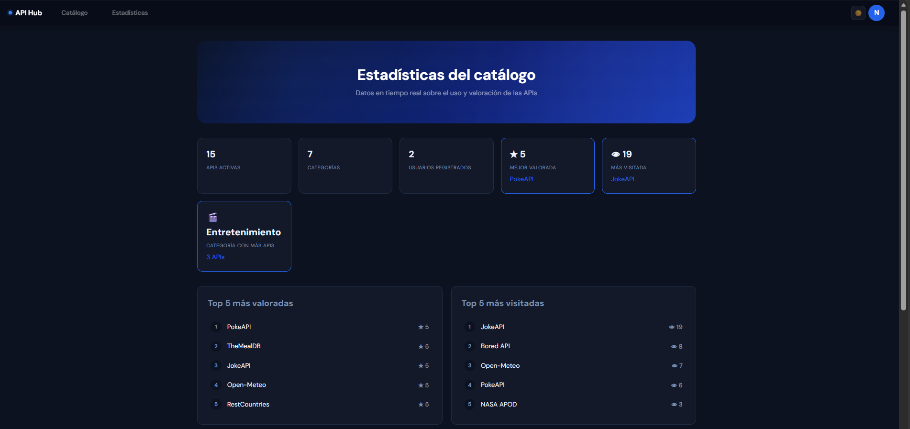
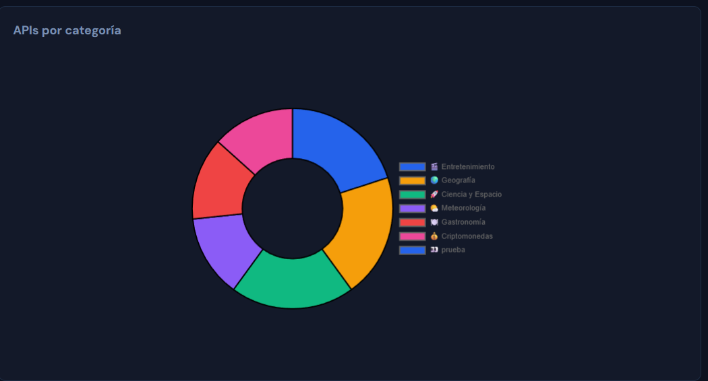
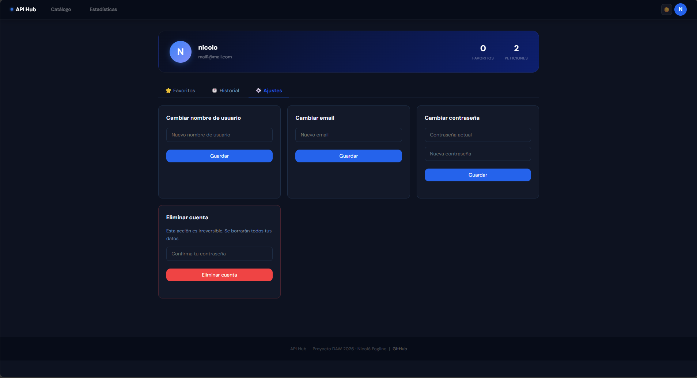
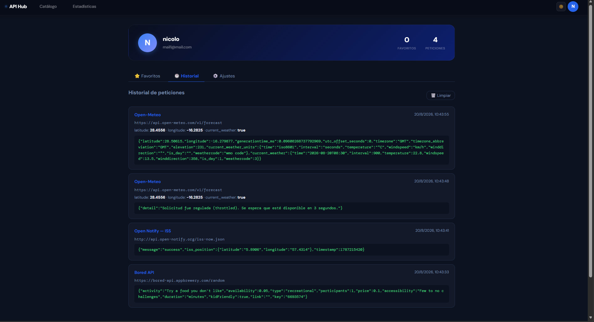
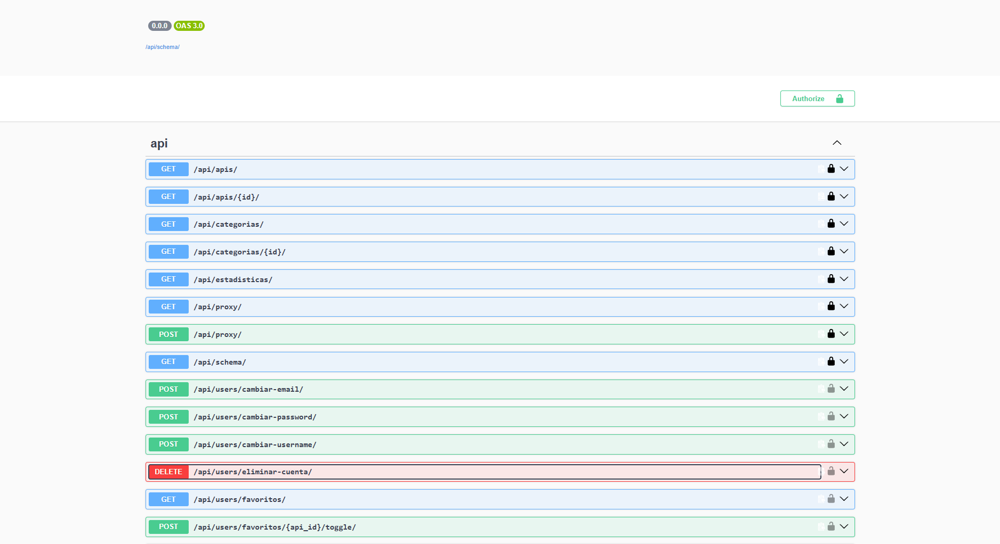

# API Hub

Directorio interactivo de APIs públicas desarrollado como proyecto final de DAW.

Permite explorar, buscar, filtrar y probar APIs reales directamente en el navegador, con sistema de usuarios, favoritos y valoraciones.

<p align="center">
  
</p>
---

## Tecnologías

- **Backend:** Python 3.14 + Django 6.0 + Django REST Framework
- **Base de datos:** SQLite (desarrollo) / PostgreSQL (producción)
- **Frontend:** HTML5 + CSS3 + JavaScript Vanilla
- **Librerías JS:** Leaflet.js, Chart.js
- **Tests:** pytest + pytest-django
- **Documentación API:** drf-spectacular (Swagger)
- **Tipografía:** DM Sans + DM Mono (Google Fonts)

---

## Funcionalidades principales

- Catálogo de 15 APIs con búsqueda, filtros avanzados y paginación
- Tester interactivo para probar cada API desde el navegador
- Renders visuales personalizados (Pokémon, ISS, Crypto, APOD, clima, recetas, países, chistes)
- Sistema de valoraciones con media global por API
- Contador de visitas por API
- Favoritos por usuario
- Perfil con pestañas: favoritos, historial y ajustes de cuenta
- Modo oscuro persistido
- Página de estadísticas globales con gráfica interactiva
- Registro con verificación por email
- Documentación Swagger en `/api/docs/`

---
## Capturas
<table>
    <tr>
    <td align="center">
      <strong>API Tester</strong><br>
      Permite realizar peticiones y consultar las respuestas de las APIs.<br><br>
      
    </td>
    <td align="center">
      <strong>Visualización</strong><br>
      Representaciones visuales de los datos obtenidos de determinadas APIs.<br><br>
      
    </td>
  </tr>
  
  <tr>
    <td align="center">
      <strong>Estadísticas</strong><br>
      Estadísticas y visualización de la actividad del catálogo.<br><br>
      
    </td>
     <td align="center">
      <strong>Gráfica de categorías</strong><br>
      Gráfica con todas las categorias disponibles.<br><br>
      
    </td>
  </tr>
    
  <tr>
    <td align="center">
      <strong>Perfil y configuración</strong><br>
      Gestión del perfil y preferencias del usuario.<br><br>
      
    </td>
    <td align="center">
      <strong> Historial</strong><br>
      Historial de las peticiones realizadas desde el tester.<br><br>
      
    </td>
  </tr>
</table>

## Documentación de la API
API Hub cuenta con documentación interactiva de sus endpoints mediante Swagger/OpenAPI.

<p align="center">
  
</p>

## Instalación local

```bash
# 1. Clonar el repositorio
git clone https://github.com/NicoFog99/apihub.git
cd apihub

# 2. Crear y activar el entorno virtual
python -m venv venv
venv\Scripts\activate  # Windows
source venv/bin/activate  # Linux/Mac

# 3. Instalar dependencias
pip install -r requirements.txt

# 4. Crear el archivo .env en la raíz
# (ver .env.example)

# 5. Aplicar migraciones
python manage.py migrate

# 6. Crear superusuario
python manage.py createsuperuser

# 7. Arrancar el servidor
python manage.py runserver
```

Accede en: http://localhost:8000

---

## Variables de entorno

Crea un archivo `.env` en la raíz con el siguiente contenido:

```env
SECRET_KEY=tu-clave-secreta-aqui
DEBUG=True
ALLOWED_HOSTS=localhost,127.0.0.1
EMAIL_BACKEND=django.core.mail.backends.console.EmailBackend
```

---

## Tests

```bash
pytest tests/ -v
```

20 tests automatizados cubriendo catálogo, autenticación, favoritos y valoraciones.

---

## Estructura

```
apihub/
├── core/        # Configuración Django
├── apis/        # App catálogo de APIs
├── users/       # App autenticación y usuarios
├── frontend/    # Templates y archivos estáticos
└── tests/       # Tests automatizados
```

---

## Autor

**Nicoló Foglino** — Estudiante de 2DAW
